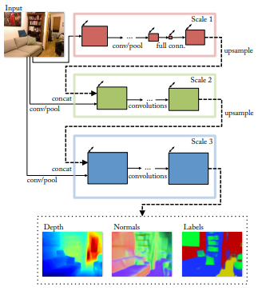
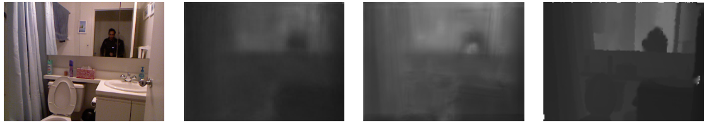
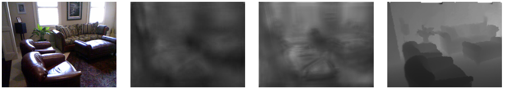
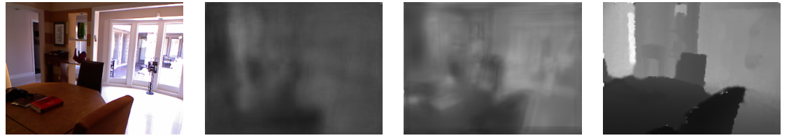

# Depth Map Prediction from Single Image in Keras

Keras implementation of the ICCV 2015 paper *"Predicting Depth, Surface Normals and Semantic Labels with a Common Multi-Scale Convolutional Architecture"* of **D.Eigen** and **R.Fergus**. 

# Authors
[paeccher](https://github.com/paeccher)
[sballari](https://github.com/sballari)

### Links
* [NYU Depth V2 Dataset](https://cs.nyu.edu/~silberman/datasets/nyu_depth_v2.html)
* [NeurIPS 2014 Paper](https://arxiv.org/pdf/1406.2283v1.pdf)
* [ICCV 2015 Paper](https://arxiv.org/pdf/1411.4734.pdf)

### Architecture



### Usage
* Download the NYU Depth V2 Dataset from the [official source](https://cs.nyu.edu/~silberman/datasets/nyu_depth_v2.html). If you don't want to download the whole dataset(430Gb) just download some scenes. Extract the scenes in the folder *data*. The expected folder structure is as follows:
```
project
│   README.md
│   error.py    
│   generator.py    
│   loss.py    
│   model.py    
│   synch.py
│   train_scale12.py    
│   train_scale3.py    
│   utils.py    
│
└───data
│   └───cafe_0001a
│       │   ...
│   └───cafe_0001b
│       │   ...
│   └─── all the other scenes...
|
└───models
│   └───scale12
│       │   modelScale12.hdf5
│       │   ...
│   └───scale3
│       │   modelScale3.hdf5
│       │   ...
```
* Run **python3 train_scale12.py** to train a network whose architecture maps to the first two scales mentioned in the paper.
    * You can pass some parameters such as the number of epochs (*--epochs* by default 3) or the learning rate(*--lr* by default 0.0001) using the command line.
    * You can also specify the name that is used to save the model (*--nameOfTheModel* by default "modelScale12.hdf5")
* Run **python3 train_scale3.py** to train a network whose architecture maps to the third scale mentioned in the paper.
    * You can pass some parameters such as the number of epochs (*--epochs* by default 3) or the learning rate(*--lr* by default 0.0001) using the command line.
    * You can also specify the name that is used to save the model (*--nameOfTheModel* by default "modelScale3.hdf5")
    * You can also pass the name of the scale12 model that is used to generate the raw depth map (*--scale12model* by default "modelScale12.hdf5")

### Qualitative results

From left to right: RGB, Raw Prediction(Scale12), Fine Prediction(Scale3) and Grount Truth



